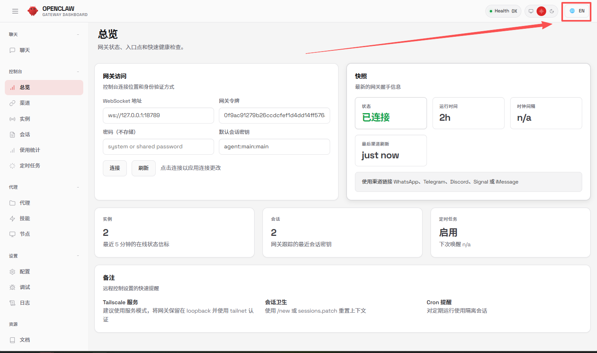
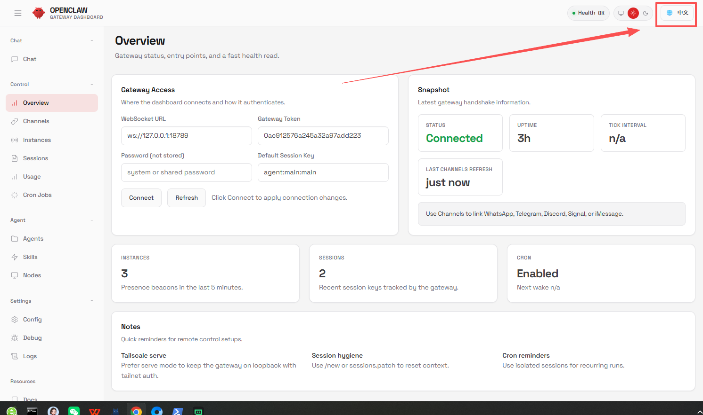
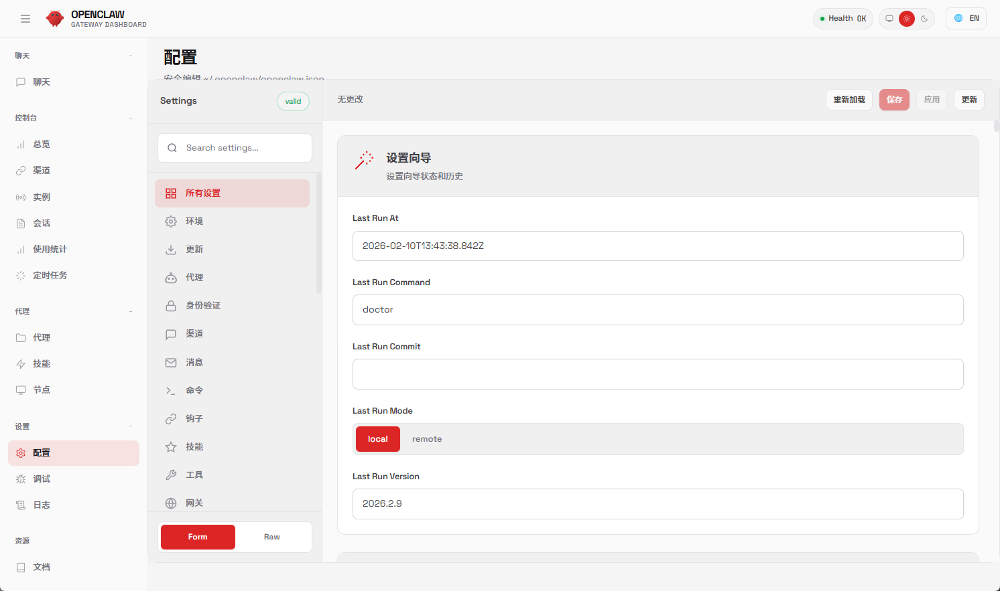

# OpenClaw 2026.2.17 中文语言包

> OpenClaw 控制台 UI 中文语言包 | Chinese Language Pack for OpenClaw Control UI

---

## 📖 项目介绍

本项目为 OpenClaw 多渠道 AI 网关控制台 提供全量、精准的中文界面翻译，支持中英文界面实时切换，适配官方 OpenClaw 源码直接安装，安装流程极简且对中国用户高度友好，覆盖控制台所有功能模块与操作流程，让中文用户无需依赖英文界面，轻松使用 OpenClaw 多渠道 AI 网关能力。

**🎯 核心优势：**

- ✅ 全局安装用户：直接替换预编译 UI，无需安装依赖
- ✅ 源码安装用户：打补丁后构建
- ✅ 保留官方所有功能
- ✅ 支持中英文一键切换

---

## 🖼️ 效果演示

| 中文界面 | 英文界面 |
|---------|---------|
|  |  |
|  | |

### v2026.2.17 (2026-02-18)

- ✅ 适配 OpenClaw 2026.2.17
- ✅ 新增预编译 UI，支持全局安装用户直接替换
- ✅ 新增一键安装脚本
- ✅ 新增中文演示截图

---

## 📄 许可证

本项目基于 [MIT License](LICENSE) 开源。

**声明：** 本项目为社区翻译，非官方 OpenClaw 的一部分。

---

## 💬 交流群 / 赞赏支持

  
  &nbsp;&nbsp;&nbsp;&nbsp;
  

---

## 📝 问题反馈

- [GitHub Issues](https://github.com/tighten724-hub/openclaw-zh-CN/issues)
- [OpenClaw 官方讨论](https://github.com/openclaw/openclaw/discussions)

---

Made with ❤️ for the OpenClaw Community

